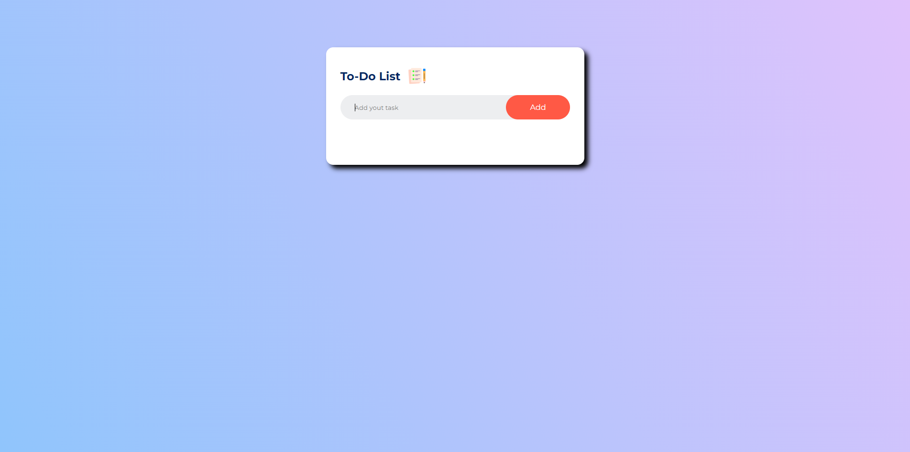
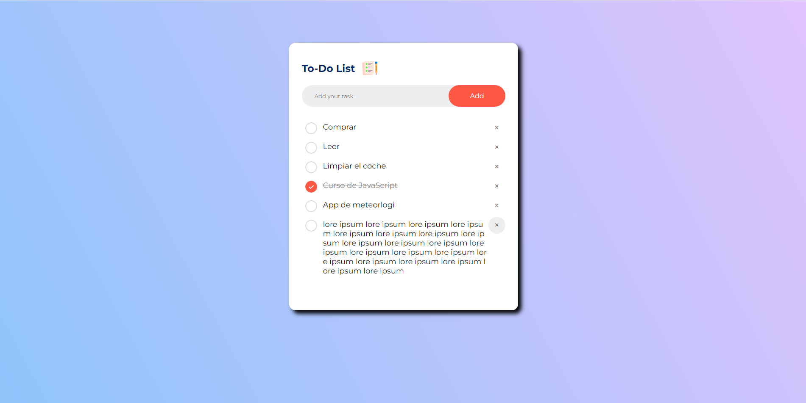
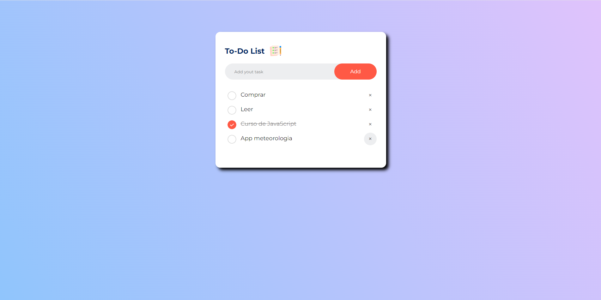

<h1>To-Do-App</h1>

  

 
Ejercicio autodidactico,
 

  

 
Una app funcional para guardar tareas con javaScripat y local storage. 
En esta app puedes añadir, poner como hechas y eliminar las trareas. 
Respecto al tutorial añado, otro estilo de fuente, el overflow para que no se salga el texto y añadire el poner tareas con el enter. 
Se usa tecnologias Js,html,css e importar fonts 
Las tareas <B>SE GUARDAN</B> en el local storage  
Es responsive. 🧮
 

<h3>ALGUNAS IMAGENES </h3>   
<h4 align= "left"> 🔵 Asi se ve la app al entrar </h4>   
     
  <h4 align= "left"> 🔵 Como se ve cuando añades tareas y marcas alguna como realizada</h4>   
    
  <h4 align= "left"> 🔵 Como se ve al eliminar una tarea</h4>   
    

  
 
 
<h6>Gracias por visitar el repo 💪 </h6>
<h6>Ejercicio de: <a href="https://www.youtube.com/watch?v=G0jO8kUrg-I">GreatStack</a> </h6>

